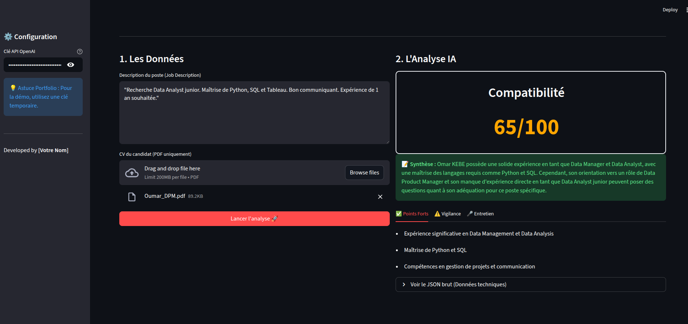

# 🤖 Smart-Screener PME

### Assistant de Recrutement propulsé par l'IA

**Le Problème :** Les dirigeants de PME passent trop de temps à trier des CVs sans avoir d'expertise RH.
**La Solution :** Une application qui analyse instantanément la compatibilité d'un CV avec une offre d'emploi et génère un guide d'entretien sur-mesure.



### 🛠️ Stack Technique
* **Langage :** Python 3.10+
* **Interface :** Streamlit
* **IA / NLP :** OpenAI API (GPT-4o-mini)
* **Parsing :** PyPDF2
* **Architecture :** RAG simplifié (Retrieval Augmented Generation)

### ✨ Fonctionnalités
1.  **Parsing PDF :** Extraction automatique du texte des CVs.
2.  **Scoring Intelligent :** Évaluation sur 100 basée sur des critères sémantiques (pas juste des mots-clés).
3.  **Synthèse RH :** Points forts et points de vigilance.
4.  **Assistant d'Entretien :** Génération de questions contextuelles pour creuser les lacunes du candidat.

### 🚀 Comment lancer le projet

1. Cloner le repo :
```bash
git clone [https://github.com/VOTRE-PSEUDO/smart-screener.git](https://github.com/VOTRE-PSEUDO/smart-screener.git)